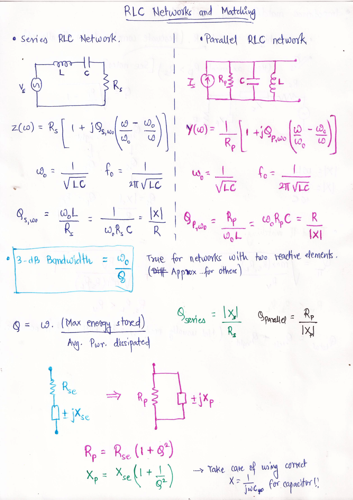
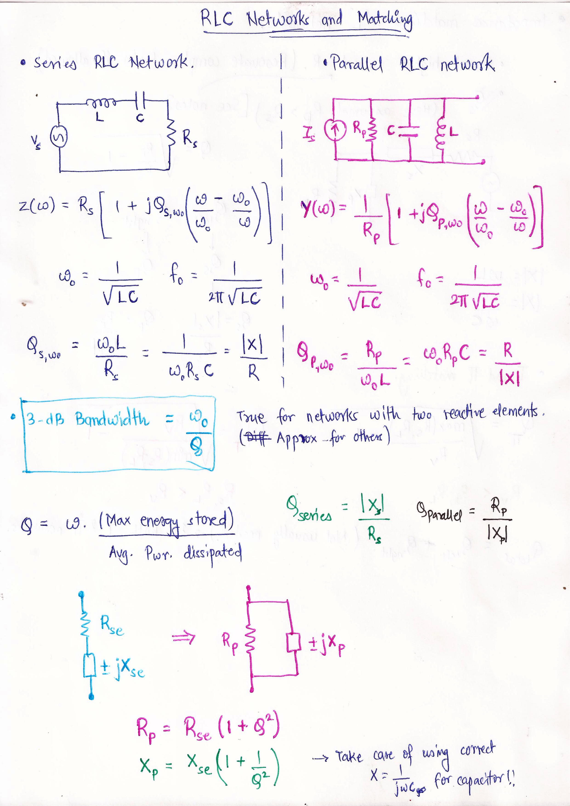
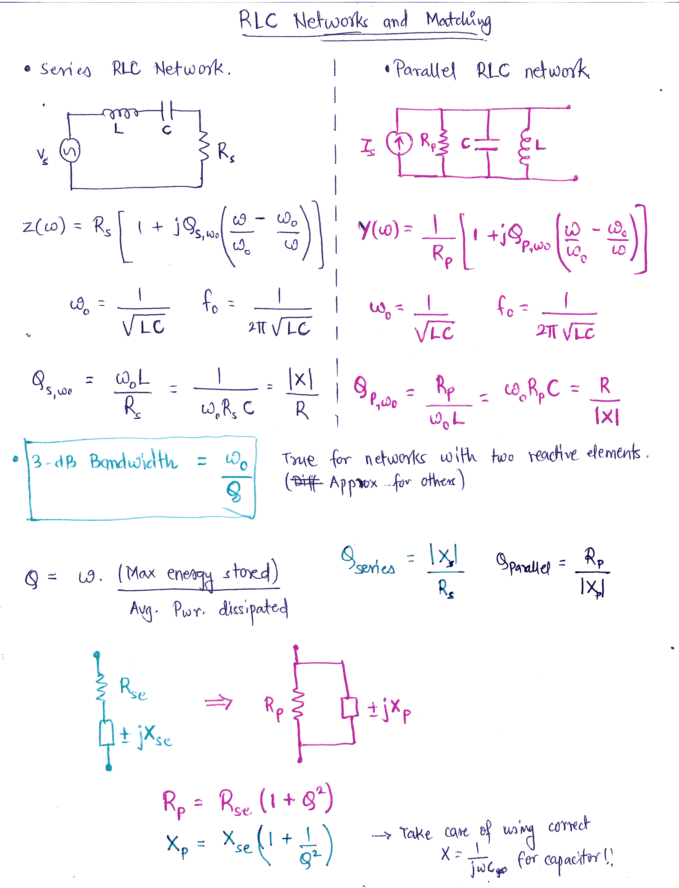
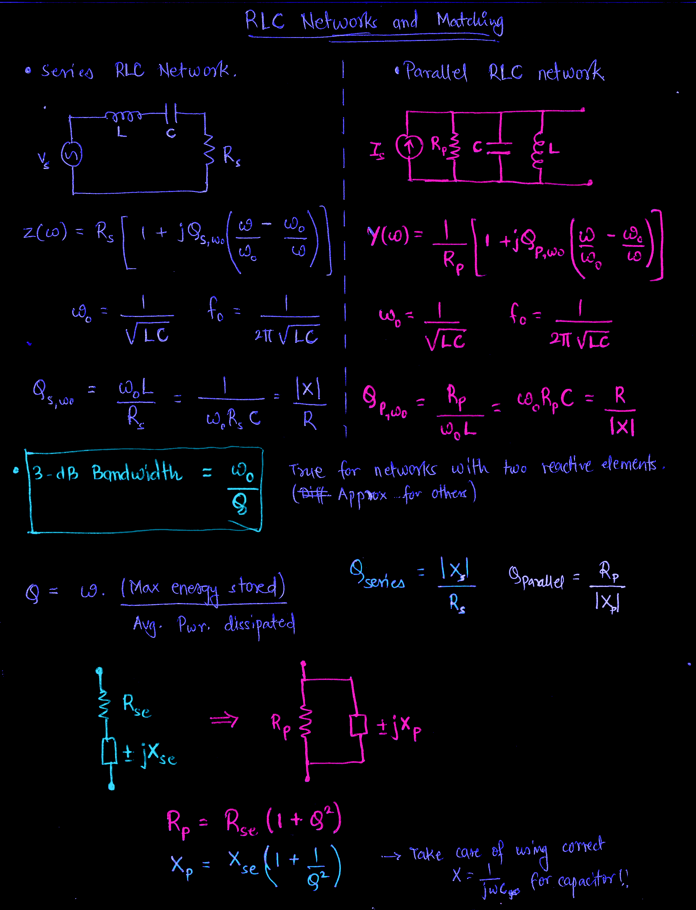
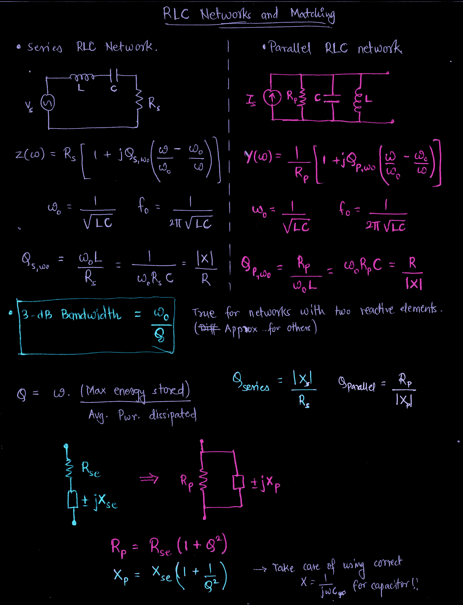
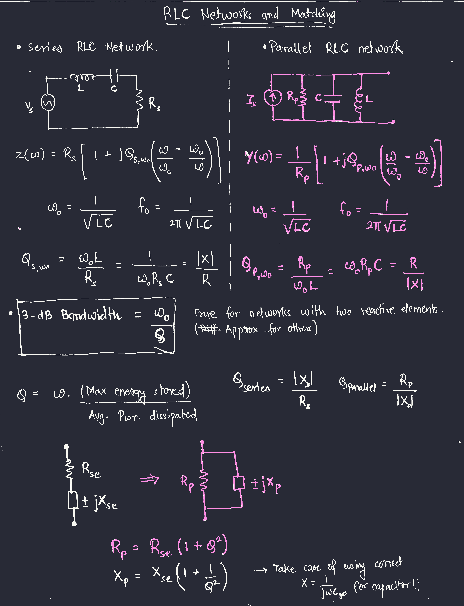
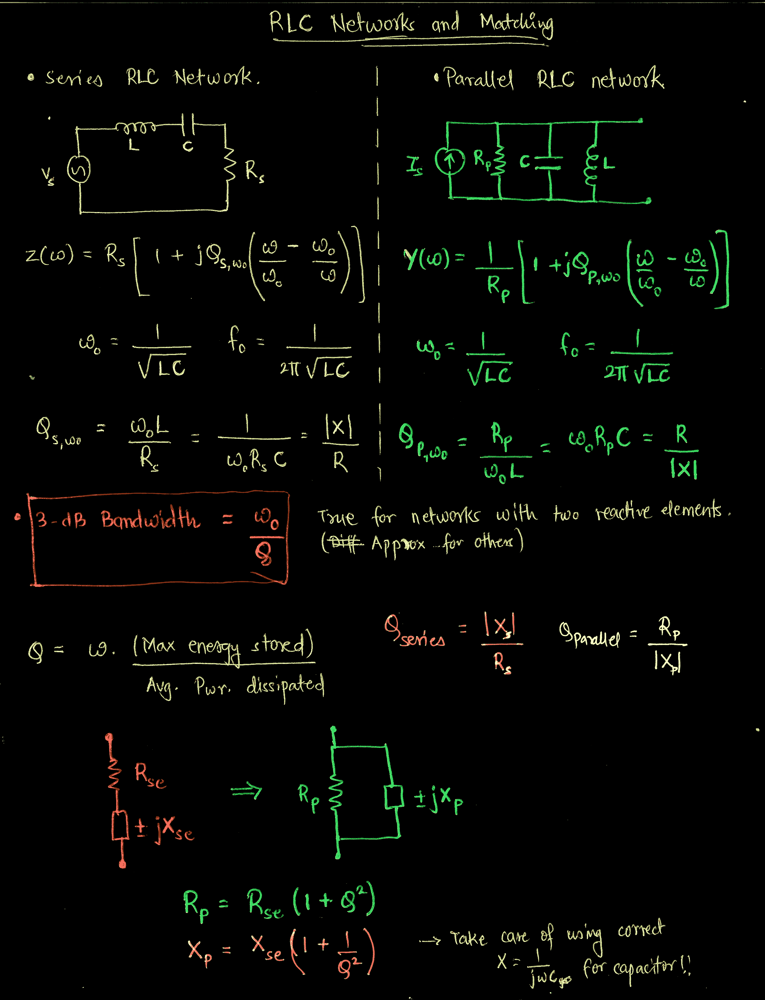

# noteshrink

Have some scanned Paper notes and moving it to digital world, where you love [Dracula Color Scheme](https://draculatheme.com/) or a dark theme? You might need this! This is a slight modification on [noteshrink by mzucker](https://github.com/mzucker/noteshrink)

Following is the list of modifications made.

- Introduce option to invert palette to **generate Dark Mode pdf of scanned notes** while maintaining the same compressed size output by the original program.
  - Invert in RGB colorspace.
  - Invert in HSL colorspace.
  - *Almost* convert to dracula color palette.

Convert scans of handwritten notes to beautiful, compact PDFs -- see full writeup at <https://mzucker.github.io/2016/09/20/noteshrink.html>

## Requirements

- Python 3
- NumPy 1.10 or later
- SciPy
- ImageMagick
- Image module from PIL or Pillow
- `pdftoppm` and`img2pdf` (if you want to use the `pdf_noteshrink.ipynb`). `convert` can be used instead of `img2pdf` but it craps out at larger pdf sizes and requires change in policy which requires root access.

## Installation

```bash
conda create --name test_env python=3.10 jupyterlab scipy numpy pillow
```

```bash
conda config --add channels conda-forge
```

```bash
conda config --set channel_priority strict
```

```bash
conda activate test_env
```

```bash
pip install git+ssh://git@github.com/siddhantladdha/noteshrink-dark.git
```

To upgrade to the latest version you need to uninstall and re-install using the following. [Source](https://stackoverflow.com/questions/71356330/updating-pip-installed-package-from-git)

```bash
pip uninstall noteshrink
```

```bash
pip install git+ssh://git@github.com/siddhantladdha/noteshrink-dark.git
```

## Usage

```bash
noteshrink-dark --help
```

```bash
noteshrink-dark IMAGE1 [IMAGE2 ...]
```

If you want to convert pdf and directly use the optimized settings to get dracula theme, create a directory named
`upload` and place the pdf files you want to convert. They should be less than 2 GB in size, so
break it up into sizeable chunks. Then execute the following from your current directory.

```bash
pdf-eat-pdf-shit --conversion_mode dracula
```

Try the following to get all the supported arguements.

```bash
pdf-eat-pdf-shit -help
```

### Usage with Tweaks

If you want to tweak the options in `pdf-eat-pdf-shit` you can clone the repository.

```bash
git clone https://github.com/siddhantladdha/noteshrink-dark.git
```

Make your changes and from the root directory of the repository run the following, which
install your local version in your virtual environment.

```bash
pip install -e .
```

## Notes on changes made by me

This is a hobby project, which contains scripts generated with help from ChatGPT and modified by me to solve a specific problem. This is by no means a production ready code and isn't meant for unsupervised execution. Backup your data before you bring this code anywhere near your data. That being said I hope this helps you.

### Motivation

I have a shit ton of handwritten notes which I would love to read digitally, annotate them and keep making new notes as I learn new things. The problem is
that the scanned notes are "light mode" (they are written on White paper with Blue/Black and colored ink). However, when I like to read something digitally
I like to use dark mode since it is easier on the eyes, plus I am a big fan of Dracula (A *universal* Dark theme). In some pdf readers you can invert the
color however, this inversion does not work well for Scanned PDFs. In addition to that I use
[GoodNotes](https://www.goodnotes.com/) on my iPad which does not support dark mode for PDF as of now.
Any new notes that I take are Dracula color themed and I personally hate the disconnect between my scanned and new notes. How much hate you ask? Well I have a love-hate relationship with programming, but I hated programming less than I hated light mode scanned notes. This I feel is a good enough motivation for me to deal with this issue in all seriousness once in for all.

### Existing tools

I scoured the internet for a tool that would do that. Here's what I found.

- [Invert-pdf](https://github.com/keotl/invert-pdf), [Website](https://invert-pdf.club/)
- [PDF Color Inverter](https://github.com/Imbernoulli/PDF-Color-Inverter/tree/main)
- [Darkpdf](https://github.com/merkez/darkpdf/tree/master)

Problems with the existing tools

- They perform inversion in RGB colorspace instead of the color correct inversion in the HSL space. i.e Blue colored strokes should look blue in dark mode instead of yellow.
- Even if I modified the code from available tools and the correct inversion took place, the size of output PDF would explode. Let me explain how I learnt this.
  1. I noteshrinked entirity of my scanned notes libarary (around 6.3 GB), with an 8 color palette and saved it as an indexed PNG. Post-processed this indexed PNG with `pngcrush`. Used `img2pdf` to convert the indexed PNG to PDF.
  2. PDF engine (here `img2pdf`) uses whatever it feels is optimal for compression on the entire PDF. So 4 MB of indexed PNG would convert to approximately 4 MB of PDF.
  3. Now I planned on reading images from this PDF, To my horror, they were being read as RGB/RGBA images, rather than indexed image. In order to do any color transformation I would have to do the tranformation on the entire image pixel-by-pixel instead of just changing the palette (which would have been faster and scalable). Say if I were to bite the bullet and do this unneccessary processing, I would still have to convert the modified image back to a paletted image. Even if I know the number of colors beforehand, the indexing procedure might gain some marginal speed up, but it still is not optimal and would be equivalent to processing the entirity of the library again all for nothing.
  4. Hence, in order to maintain the indexed nature of PNG's the correct approach is to modify the palette before it is written to the PNG and/or before the conversion to PDF. This is what this modified code does.

### New Options and their working

If you don't know anything about image processing and want to just use the program here is the approach.

1. Do you want a light mode noteshrinked pdf?
   - Yes: You can use the original program or this program with regular options or "-w" recommended.
   - No: Read next question.
2. Do you want a dark mode noteshrinked pdf without thinking too much?
   - Yes: You should use the "--dark_mode" option.
   - Do you specifically want Dracula color scheme?
      1. Yes: Well you almost got it! Use the "--dracula" option.
      2. No, I want it perfect!: Sorry I did not add that feature for few reasons (explained later.)
   - Do you want a crappy negative in RGB space?
      - Yes, I am an idiot: Use the "--invert_rgb" option.
      - No, I want a color correct dark mode pdf.
        - Do you want to make the colors in dark mode a little more vibrant (Increase saturation in HSL space)?
          - Yes: Use the "--dark_mode" option.
          - No: Use the "--invert_hsl" option.

Why did you not use the actual dracula colors and cheaped out on just increasing the saturation?

I tried soo hard and got so far and in the end it didn't even matter! I tried using minimum distance thresholding in the HSL and CIELab color space. However, I got a feeling of the result not looking attractive enough (For image processing my notes I do care how things look and are percieved.) As it turns out my gut feeling was right. The original noteshrinked image contains a lot of artifacts in different colors due to me being flexible in allowing it to use the 8 color palette. These artifacts made it look terrible, hence I stopped with the approach, and instead went along simpler path. Majority of dracula colors have a luminance around 70% and are maximally saturated. So that is what I exactly did. Maintain the hue and fix the luminance and saturate the color. For background I did a hard replacement to the actual background color the theme. And for any blue/black ink (majority of the content) I hard mapped it to the foreground color. Feel free to modify the function doing this `dracula_palette()` to suit your own taste.

### Procedure

My procedure is documented in [./pdf_noteshrink.ipynb]. I would recommend since the procedure has a few tricks for taking PDF inputs as well as directory management for archival purposes so that
you can change the color scheme down the line without having to noteshrink again. I also use some contrast enhancement pre-processing to improve the results.

## Results

### Original Image 3.3 MB



### Preprocessed Image 3.4 MB



### Noteshrinked Light Mode Image 427 KB



### Noteshrinked Dark Mode Image 429 KB



### Noteshrinked HSL Inverted Image 427 KB



### Noteshrinked Dracula Themed Image 427 KB



### Noteshrinked RGB Inverted Image 427 KB


